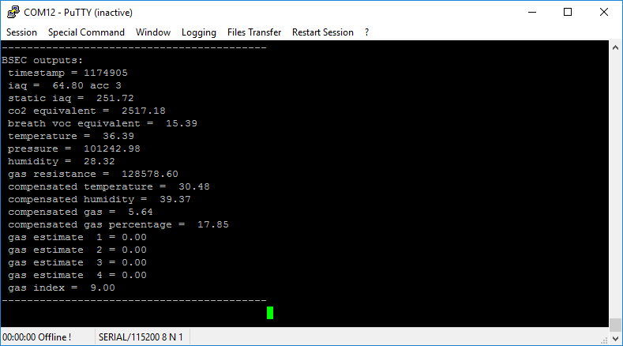
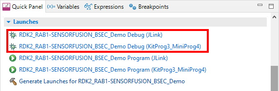

# RAB1-SENSORFUSION BME688 BSEC Demo

Rutronik Adapter Board 1 - Sensorfusion with Rutronik Development Kit 2 Demo Application. Bosch Software Environmental Cluster is used for the BME688 Sensor.

Firmware example running on the RDK2 initiates and tests the BME688 sensor on the RAB1-SENSORFUSION board.

 

## Requirements

- [ModusToolbox® software](https://www.infineon.com/cms/en/design-support/tools/sdk/modustoolbox-software/) v3.0

The BME688 data is read out and processed by BSEC firmware stack. The BSEC outputs are   printed out to the KitProg3 UART port.

Using the code example with a ModusToolbox IDE:

1. Import the project: **File** > **Import...** > **General** > **Existing Projects into Workspace** > **Next**.
2. Select the directory where **"RDK2_RAB1-SENSORFUSION_BSEC_Demo"** resides and click  **Finish**.
3. Update libraries using  a **"Library Manager"** tool.
4. Select and build the project **Project ** > **Build Project**.

### Debugging

If you successfully have imported the example, the debug configurations are already prepared to use with a the KitProg3, MiniProg4, or J-link. Open the ModusToolbox perspective and find the Quick Panel. Click on the desired debug launch configuration and wait for the programming to complete and debugging process to start.

## Legal Disclaimer

The evaluation board including the software is for testing purposes only and, because it has limited functions and limited resilience, is not suitable for permanent use under real conditions. If the evaluation board is nevertheless used under real conditions, this is done at one’s responsibility; any liability of Rutronik is insofar excluded. 

